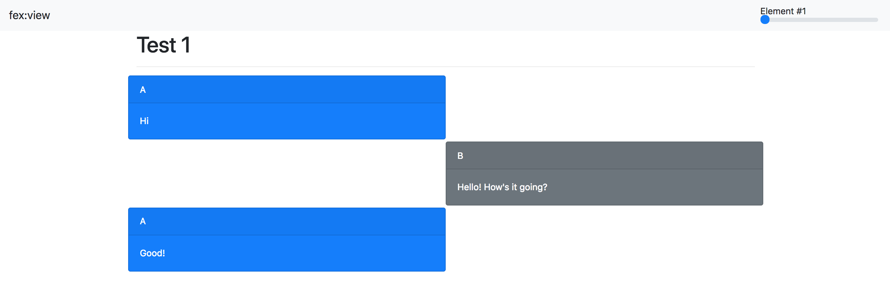

============================================================
fex - a simple, fast data explorer
============================================================
Ever have a pile of data (stored as JSON objects) that you want to
quickly visualize and scroll through?
Here's a simple package that will let you do just that.
It takes as input your data (``data.jsonl``), a file where every line is a
JSON object, and (optionally) a ``template.html`` file that specifies how
to render that single object.

Installation
------------

::

    # from git repo
    git clone https://github.com/arunchaganty/fex
    pip install -e .
    
    # OR from PIP (upcoming)
    pip install fex

Usage
-----

Fex assumes that your data is formatted as ``.jsonl``: each line is simply its own JSON object.
For example, consider the following `data <example/data.jsonl>`_.

::

  {"id": 0, "title": "Test 1", "messages": [{"user": "A", "msg": "Hi"}, {"user": "B", "msg": "Hello! How's it going?"}, {"user": "A", "msg": "Good!"}]}
  {"id": 1, "title": "Test 2", "messages": [{"user": "B", "msg": "I need help!"}, {"user": "A", "msg": "Uh oh! What happened?"}, {"user": "B", "msg": "Sorry, false alarm, everything is ok."}]}

Running ``fex view`` will launch a web server that visualizes each of
these objects using a template rendered with `Jinja <http://jinja.pocoo.org/>`_.
Fex provides a default visualization is already prettier than staring
at JSON:

The real power of Fex comes from being able to quickly hack a template
that you find more useful. For example, the above data represents a chat
transcript and it would be much nicer to visualize it as such.
To do so, first run ``fex init``, which will copy over a ``template.html``
file that you can edit. Using the `example template <example/template.html>`_
produces the following result: 

Nice!

Notice the navbar at the top that will allow you to quickly toggle
through input.

Frequently asked questions
--------------------------

- *Q*: Can I use paths that are not ``data.jsonl`` or ``template.html``?
- *A*: Yes! Use the options ``-i`` or ``--input`` to specify the data file
  and ``-t`` or ``--template`` to specify the template file: ``fex view -i
  mydata.jsonl -t mytemplate.html``.

